# HyperMind 01 — design body

This pass implements the plan in [PLAN.md](../../PLAN.md) with the harness-derived changes in [HARNESS-LESSONS.md](../../HARNESS-LESSONS.md). This specification takes precedence where wording differs.

## The stack, and how it is built

The system is eight layers. It is **not** built one layer at a time. Every wave is a vertical slice that adds to every layer and ends with a runnable journey through all of them.

```mermaid
flowchart LR
    subgraph L["Layers (the stack)"]
        direction TB
        L7["L7 eval + docs"]
        L6["L6 surfaces: UDS · MCP · gRPC · REST · CLI · SDKs"]
        L5["L5 compose: planner · lanes · fusion · bundle"]
        L4["L4 cognition: ingest · NREM · REM · FSRS · adjudication · attention"]
        L3["L3 index + providers: lexical · vector · entity · embed · llm"]
        L2["L2 projections (LMDB, checkpointed, generations)"]
        L1["L1 ledger: frames · segments · sealing · MMR"]
        L0["L0 schema + core: events · protocol · errors · ids"]
    end
    subgraph W["Waves (vertical slices)"]
        direction LR
        W1["W1 Spine"] --> W2["W2 Continuity"] --> W3["W3 Trust"] --> W4["W4 Meaning"] --> W5["W5 Belief and time"] --> W6["W6 Sleep"] --> W7["W7 Anticipation"] --> W8["W8 Reach"]
    end
    W1 -. "adds to every layer" .-> L
    W8 -. "adds to every layer" .-> L
```

### Layer × wave matrix

Each cell is what that wave adds to that layer. A wave is done only when its row's integration task passes.

| Wave | L0 schema | L1 ledger | L2 projections | L3 index / providers | L4 cognition | L5 compose | L6 surfaces + SDK | L7 eval + docs |
| --- | --- | --- | --- | --- | --- | --- | --- | --- |
| **W1 Spine** | UserMsg, DeliveredMsg, ToolCall, ToolResult, Attestation; protocol Hello/Append/Recall/Activate/Transcript; error codes | frame codec, segment log, group commit, torn-tail repair, sealing with AAD | LMDB store with checkpointed apply; timeline; lexical | tantivy postings, fixed-point BM25; tiktoken counts | authority tagging at ingest | bundle v1 (conversation, fused), exact token budget, HMA1 canonical bytes, gaps[] | UDS server, actor engine; MCP remember/recall/activate/inspect; Rust embedded API; `hm` CLI | eval runner, seeded stores, recall@10, latency; schematics skeleton; quickstart |
| **W2 Continuity** | Checkpoint, IntentSet, Loop*, Binding, Effect/Approval/Outcome, ordering rules | idempotent append (conn_id, client_seq), dedup rebuild, torn-batch rollback | intent frame, bindings, work ledger, latest checkpoint | — | — | required tiers never shed; narrow-subtask gap; allocation template | Checkpoint/Subscribe requests; effect_state on errors; MCP intend/bind; TS napi + client with sequence recovery; renderer v1 | fault simulator (kill at every LSN, 2048 schedules); continuity and silent-degradation suites |
| **W3 Trust** | authority enum, sensitivity, retention on envelope | MMR over sealed bytes, signed checkpoints, `hm verify`, crypto-shred receipt, key rotation, tripwire LSN set | tripwire hits, attestation projection | — | laundering invariants: derivation lowers authority; Outcome cites observed LSNs | activation safety in renderer; RetrievalManifest stages; attestation frames | admin token split, Verify/Rebuild/CryptoDelete/RotateKeys; MCP inspect(verify, provenance), forget | laundering suite; fuzz targets; threat model |
| **W4 Meaning** | Embedding event with space identity | — | vector lane (flat int8 + Hamming prefilter), entity index, space generations | hm-embed: ort local + remote, batching, hash cache | — | query planner, lanes, RRF, health states, deadline + cached fallback, anchor/near | recall modes semantic/entity/near; remember anchor/retention/sensitivity | recall@k at 1k/10k/100k; p99 at 100k; LongMemEval baseline |
| **W5 Belief and time** | Assertion, Consolidation, Retract, ProposedAssertion; event_time_ns; byte-offset provenance; AsOf request | belief admission gate | belief store (versions, conflict edges, as-of valid_at/known_at), temporal ladder, protected types | hm-llm minimal providers; in-process NLI ONNX | adjudication ladder with tier caps | resident, conflicts, temporal tiers; asof/timeline modes | MCP believe/retract/dispute | temporal suite; stale-fact rate; protected-type writes |
| **W6 Sleep** | Memory*, Edge*, Consolidation{Opened,Phase,Closed,Retracted}; run_id, model_provenance | — | memories, graph, fsrs, runs, active_generation, leases, retraction override | full provider set, prompt registry, structured outputs, cost accounting | NREM cluster/merge/mint with citations; REM connect/abstract/hindsight; FSRS review with protection sets; phase machine; budgets | graph lane; attest closes the loop | MCP consolidate/attest; CLI consolidate | dream regression; citation validity; publish/rollback; LongMemEval ≥ 80 |
| **W7 Anticipation** | Intention*, AttentionDecided, Predicted, OutcomeObserved, Procedure* | — | intentions, attention history, predictions, procedures | HNSW lane (usearch) > 50k; optional reranker | wake evaluation, attention scorer, prediction assessment, procedural ladder | prospective tier; procedure rendering by state; reconstruct mode | MCP predict/outcome; intend with wake triggers; recall reconstruct | attention precision; calibration; LongMemEval ≥ 90; LoCoMo ≥ 75 |
| **W8 Reach** | protocol v3 frozen; OpenAPI | key rotation hardened | — | model download with digests | — | — | gRPC + mTLS, REST, Python SDK, Go client extension, migrate-from-cortex, TUI, packaging | full benchmark run; determinism cross-arch; docs site; v1.0.0 |

### Slice journeys

Every wave's integration task is one executable journey that crosses every layer:

1. **W1** — `remember` a fact over MCP, kill the daemon, restart, `recall` it lexically, `activate` returns it in the bundle with a provenance URI, eval reports recall@10 and p99.
2. **W2** — open a loop, `bind` a file at a revision, dispatch a tool, kill -9 in the dispatch window, restart, `activate` shows the loop, the binding and the unreconciled effect; the client resumes its sequence without a duplicate append.
3. **W3** — append, cite a tool result with an MMR receipt, run `hm verify` offline with no key, attempt to launder a model string into `tool_observed` and be rejected, trip a tripwire, crypto-shred and receive a signed receipt.
4. **W4** — ingest 10k events with local embeddings, recall an identifier through the entity lane and a paraphrase through the vector lane, hit the deadline under load and receive the stale bundle marked degraded, then the fresh bundle by subscription.
5. **W5** — assert a fact, supersede it with a validity interval, ask `asof` by `valid_at` and by `known_at` and get different answers, dispute two claims through NLI, attempt a direct identity write from a run and be rejected with a proposal surfaced instead.
6. **W6** — run NREM and REM as a generation with a budget, see a minted memory with byte-range citations, retract the run, observe activation switch back instantly, rerun idempotently.
7. **W7** — set an intention on a repository change, trigger it, see the attention decision batch it under quiet hours, register a prediction with a bounded predicate, observe a contradicted outcome, watch a procedure move from tentative to supported after three independent episodes.
8. **W8** — the W1–W7 journeys over gRPC from Python and Go, a real cortex-engine store migrated and verified, the docs site built and gated, the benchmark suite published.

## Ownership lanes

| Lane | Production paths | Purpose |
| --- | --- | --- |
| root-foundation | `Cargo.toml`, `crates/hm-core`, `.github`, `deny.toml`, `rust-toolchain.toml` | Workspace, ids, errors, CI. Root alone edits shared manifests and spec state. |
| schema | `crates/hm-schema`, `schemas/` | FlatBuffers events and protocol, generated code, validation. |
| ledger | `crates/hm-ledger` | Frames, segments, sealing, MMR, checkpoints, tripwires. |
| projections | `crates/hm-proj` | LMDB store, every projection, generations, leases. |
| index | `crates/hm-index`, `crates/hm-embed` | Lexical, vector, entity lanes; embedders. |
| cognition | `crates/hm-cortex`, `crates/hm-llm`, `prompts/` | Ingest, NREM, REM, FSRS, adjudication, attention, procedures. |
| compose | `crates/hm-compose` | Planner, lanes, fusion, bundle, deadline. |
| surface | `crates/hm-serve`, `crates/hm-mcp`, `crates/hm-cli` | Actor engine, UDS, gRPC, REST, MCP, CLI, TUI. |
| sdk | `sdk/typescript`, `sdk/python`, `sdk/go` | Clients, renderers, migration. |
| eval | `crates/hm-eval`, `crates/hm-sim`, `eval/` | Simulator, suites, gates, benchmark datasets. |
| docs | `docs/`, `README.md` | Schematics, ADRs, site, threat model. |
| integration | `crates/hm-sim/tests/slice*_journey.rs` | One journey per wave; owned by root. |

## Persistence and concurrency

One writer task per actor owns the segment log, the LMDB write transaction and LSN assignment. Readers use LMDB read snapshots pinned to a generation. Projection apply is one write transaction that commits mutations and the projection checkpoint together and requires `applied_lsn == checkpoint + 1`. A SIGKILL between apply and ack leaves each projection at an exact LSN; rebuild resumes from the minimum checkpoint. Consolidation runs stage derived events into a generation and publish with a compare-and-swap; retractions apply to every generation including leased ones.

No LLM, embedder or network call inside a write transaction. The embedder runs before append; its output is an `Embedding` event. The LLM runs only in `hm-cortex` background tasks under a declared budget.

## Determinism

Fixed-point BM25, int8 dot products with a SIMD/scalar equivalence test, canonical serialisation of every bundle, and a fault simulator that must converge to identical `CanonicalBytes` over 2,048 schedules. Same log, same bundle hash, on x86-64 and aarch64.

## Proof

Real LMDB and segment files in temporary directories, the real daemon over a real Unix socket, real subprocess kills, real ONNX inference for the local embedder and NLI model. Remote LLM and embedding providers are exercised through recorded wire fixtures and reported as such; a live-provider result is claimed only when it ran. Coverage is reported per crate; the gates that matter are the eval suites named in each task.
