<!-- GENERATED by spec/specgen from spec/ kvx — DO NOT EDIT. Edit the .kvx source and regenerate. -->

Eight layers: L0 schema and core, L1 ledger, L2 projections, L3 indexes and providers, L4 cognition, L5 compose, L6 surfaces and SDKs, L7 eval and docs. Eight waves: Spine, Continuity, Trust, Meaning, Belief and time, Sleep, Anticipation, Reach. Each wave is a slice through all eight layers. See design.body.md for the layer by wave matrix, the slice journeys and the ownership lanes.

## Authority, scope and milestones

This spec.kvx is the implementation contract. Its design sections and acceptance criteria are normative. PLAN.md and HARNESS-LESSONS.md are rationale and are not a second editable spec. Generated requirements.md, design.md and tasks.md are views.

Canonical source is spec/hypermind-01/spec.kvx in the HyperMind-engine repository. The neocortex-engine and cortex-engine trees are read-only donors; their test vectors and fixtures are carried in, their code is ported, never linked.

- W1-W2: a daemon an agent can remember into, recall from, checkpoint against and survive a crash with, over MCP, from Rust and TypeScript, with a fault simulator and an eval gate
- W3-W5: proof, meaning and time: verifiable without keys, semantic and entity recall under a deadline, bitemporal beliefs with adjudication and a protected self
- W6-W7: sleep and anticipation: consolidation as retractable generations with citations, prospective memory gated by attention, predictions with assessment, procedures earned from independent episodes
- W8: reach and qualification: gRPC, REST, Python and Go, migration from cortex-engine, docs site, published benchmarks, v1.0.0

The feature is complete when every task is done, every slice journey passes in CI, and the wave 8 benchmark run meets the targets in req.15. A milestone is usable on its own; an experimental lane left disabled after a completed and reported evaluation is acceptable and is named in the handoff.

- A second memory authority beside the ledger, or a graph database as a prerequisite
- Model weight training, parameter memory, or claims about intelligence beyond the measured behaviours
- Persona, social, content or mood features inside the engine; those are plugins
- Unauthenticated federation, or cross-process locking on one actor directory
- Runtime-cost minimisation as the definition of good; prioritise measured behaviour per slice

## Vertical build discipline

The system is a stack, and it is built by stacking slices, not by pouring layers. A wave that adds a projection also adds the event that feeds it, the request that reads it, the tier or tool that surfaces it, the SDK call that reaches it, and the eval that measures it. A task that delivers a layer whose consumer is in a later wave violates this contract and is split.

- W1 Spine: remember and recall one thing end to end, survive a restart
- W2 Continuity: survive a kill mid-turn and resume the loop with exact bindings
- W3 Trust: prove the log without keys, never launder authority, shred with a receipt
- W4 Meaning: semantic, entity and planned recall that never blocks the turn
- W5 Belief and time: bitemporal beliefs, adjudication, a protected self
- W6 Sleep: consolidation as retractable generations with byte-range citations
- W7 Anticipation: wake triggers, attention, predictions, procedures
- W8 Reach: gRPC, REST, Python, Go, migration, docs, benchmarks, release

Each wave ends with one integration task that requires every lane task in the wave and whose verify_cmd runs that slice's journey test through MCP, daemon, ledger, restart and recall. Lane tasks in wave N+1 require the integration task of wave N. That dependency is what makes the build vertical: nothing in a later slice rests on an unproven layer.

Task 1.1 alone may create empty crates for later waves so the workspace compiles. An empty crate is scaffolding, not a layer. Adding behaviour to a crate that no task in the current wave consumes is a violation.

Lanes are file scopes, not layers. The ledger lane contributes to every wave; so does the eval lane. Parallelism is across lanes inside one wave, never across waves.

## The stack

hm-core and hm-schema: ids, revisions, error codes, FlatBuffers events (schema v2, additive over neocortex v1, file identifier NCEV) and protocol (v3 additive over neocortex v2, NCPR). Every persisted and wire-visible type carries a version.

hm-ledger: 43-byte frame header, CRC32C frames, segment log with group commit, torn-tail repair and interior-corruption refusal, XChaCha20-Poly1305 sealing with AAD bound to actor, lsn, kind and user, Merkle Mountain Range over sealed bytes, Ed25519 checkpoints, idempotent append keyed by connection id and client sequence, tripwire LSN set, crypto-shred with signed receipt, key rotation.

hm-proj: one LMDB environment per actor; each projection applies in one write transaction that commits mutations and its checkpoint together; rebuild from any prefix is byte-identical; generations with compare-and-swap publish, reader leases and retraction override. Projections: timeline, lexical, entities, vectors, beliefs, graph, memories, fsrs, intent frame, bindings, work ledger, intentions, attention history, predictions, procedures, attestations, temporal ladder, runs.

hm-index and hm-embed and hm-llm: tantivy postings with fixed-point BM25; flat int8 vector lane with binary prefilter and an HNSW lane above 50k; rule-based entity index; embedder trait with local ONNX and remote providers, batched and content-hash cached, with space identity; LLM provider trait with Anthropic native, OpenAI-compatible, Gemini and Ollama, structured outputs only, a versioned prompt registry and cost accounting.

hm-cortex: ingest with authority tagging, NREM cluster and merge and mint with citation validation, REM connect and abstract and hindsight, FSRS-6 review with retention classes and protection sets, adjudication ladder with in-process NLI and tier-capped LLM supersession, wake evaluation and attention scoring, prediction assessment and calibration, procedural mining with a learning ladder. Always background, always budgeted, always a generation.

hm-compose: query planner, lanes, reciprocal rank fusion, optional reranker, ten-tier activation bundle with exact token counts, required tiers that are never shed, trim and coarsen policy, HMA1 canonical bytes, retrieval manifest, gaps and health, hard deadline with cached fallback.

hm-serve, hm-mcp, hm-cli and sdk: Unix socket with NCPR framing, gRPC over mTLS carrying the same envelope bytes, REST with OpenAPI, MCP with thirteen verbs and one envelope, CLI and TUI, Rust embedded API, TypeScript napi and client, Python PyO3 and client, Go client extension, renderers with activation safety.

hm-eval, hm-sim and docs: fault simulator, slice journeys, internal suites, LongMemEval, LoCoMo, BEAM, latency and cost and determinism reports, CI gates, schematics, ADRs, docs site.

## Minimum record contracts

EventEnvelope v2 = neocortex v1 fields plus origin_actor, run_id, model_provenance, authority, retention, sensitivity, event_time_ns. Frame header stays 43 bytes. The MMR leaf commits to the sealed bytes; a plaintext digest inside the sealed record supports content proofs.

authority is one of user_asserted, external_observed, tool_observed, runtime_fact, assistant_generated, derived_inference. Ingest sets it from source kind. Derivation lowers it to derived_inference unless the derived text is a verbatim quote of a cited byte range. It is rendered on every surfaced item and never omitted.

ProvenanceRange = first_lsn, last_lsn, optional byte_start and byte_end into the cited payload. Provenance URI hm://actor/conversation/lsn with at, src, score, vr, lr, why and run query fields.

Assertion carries belief_id, type in fact, preference, constraint, goal, identity, canonical_identity, value, valid_from_ns, valid_to_ns, provenance ranges, conflict_domain, claim affirmative or negative_existence. identity, constraint and preference are protected: runs emit ProposedAssertion. Negative existence needs a corroborating tool_observed LSN in its provenance or admission fails with kNegativeExistenceUncorroborated.

Binding = task or scope, canonical entity, property, evidence LSN, revision, freshness requirement, status resolved or missing or stale or conflicting. Bindings are resolved from one snapshot independent of ranking and are never shed from a bundle.

IntentionSet = objective, WakeTrigger, expiry, reply route. WakeTrigger is one of at, schedule, child_terminal, process_exit, file_changed, repository_changed, channel_message, external_condition, user_response, entity_mentioned, loop_closed, prediction_resolved, belief_changed. IntentionFired carries a stable wake id used as an idempotency key. AttentionDecided is one of ignore, remember, batch, schedule, ask_user, start_work, notify with a user-readable reason.

Predicted = immutable id and revision, task and attempt and operation linkage, bounded expected predicates (object exists in scope, revision or digest equals, receipt matches, typed property satisfies a bounded predicate, process terminated with observed result, answer committed), deadline, uncertainty text. OutcomeObserved = assessment supported or contradicted or pending or unresolvable or not_executed, observation LSNs, evaluator version.

Procedure = conditional strategy, expected outcomes, preconditions, independent supporting episodes, failures and counterexamples, state tentative or supported or adopted. supported requires at least three independent source roots from at least two conversations. adopted requires a user-authority event. Only adopted procedures render as instructions.

Memory = name, definition, tags (open set with a curated core), salience, embedding reference, authority, retention, sensitivity, fsrs state, provenance, run_id. MemoryMinted, MemoryRevised, MemoryMerged, MemoryFaded are events; definitions are never overwritten in place.

Edge = source, target, relation, weight from evidence count, evidence LSNs, valid_from and valid_to, run_id. EdgeAsserted and EdgeRetracted are events.

ConsolidationOpened = run_id, phases, prompt versions, model ids, budget. ConsolidationPhase records progress with a per-attempt idempotency prefix. ConsolidationClosed is the publish compare-and-swap. ConsolidationRetracted switches active_generation back.

RetrievalManifest = query identity digest, snapshot epoch, encoder and index generation, candidate lanes, selected ids, included ids, used ids from attestation, gaps, degraded reasons, health.

## Recall and activation

Deterministic query-shape rules first: identifier-like queries lead with the entity lane; temporal phrases open a ladder window; why or how questions add graph expansion and procedures; otherwise semantic leads. A learned planner may replace rules only behind the eval gate.

vector (binary prefilter then int8 dot, flat below 50k and HNSW above), lexical (fixed-point BM25), entity (exact postings), temporal (ladder descent and recency prior), graph (one to two hops over validated edges with validity intervals, at most 200 visited nodes), belief (as-of heads and obligated conflicts). Every lane is a pure index read.

Reciprocal rank fusion over canonical ids, never raw scores across spaces. Composite = rrf times fsrs retrievability times salience factor times recency prior. Optional cross-encoder rerank of the top 32, off by default, enabled per deployment only when hm-eval shows a gain.

resident, intent, bindings, work_ledger, prospective, conversation, entity, conflicts, fused, temporal. The first four are required and never shed; if they alone exceed budget the bundle narrows the active subtask and reports a gap. Trim sheds from the tail and coarsens conversation items to lsn plus first line before touching required tiers.

Token cost is exact per target model through tiktoken or HF tokenizers. Default allocation: mandatory 15 percent, intent and bindings and work 10, conversation 40, recall 15, tools 10, reserve 10. Optional segments shrink first.

activate has a hard deadline, default 25 ms. On a miss it returns the conversation's last bundle marked degraded with stale_by_lsn and the query it was built for, and pushes the fresh bundle over Subscribe. The foreground SDK call cannot fail because memory is slow.

semantic_ready, semantic_lagging, lexical_only, unavailable, reported separately for encoder, backlog, projection and actual inclusion. gaps[] lists missing or stale bindings, truncated lanes, index lag, dropped tiers and pending protected-type proposals. Silent degradation is a tested bug class.

The SDK renderer emits typed sections with the authority class and provenance URI on every item; only semantic kinds; only items with full provenance; same-turn exclusion; no raw bytes; memory content never takes the system or developer role. Reconstruction output is labelled RECONSTRUCTION, carries assistant_generated, and the SDK refuses to remember it verbatim.

## Ingest, sleep and learning

Per turn: append episodic events with authority from source kind, embed batched and cached by content hash, extract entities, prediction-error gate against the nearest memory, Observed marker. No LLM. memory.* events are never re-ingested. retention do_not_store returns a receipt and writes nothing. Automatic sensitivity is capped at personal.

Cluster unprocessed observations by embedding and entity overlap without an LLM. One structured-output call per cluster returns attach or revise or mint with citations. Every quoted span must be a substring of a cited byte range inside the run's frozen candidate set or the candidate is dropped and counted. Output authority is derived_inference unless verbatim. Mint requires at least three independent source roots from at least two conversations; a speculation-typed source poisons the candidate. Thought-quality and rewrite-guard run as measured classifiers with logged decisions.

Connect from cluster adjacency and entity co-occurrence with one long-context pass, never pairwise LLM calls; edge weight from evidence count. Abstract across tags with a novelty gate against store and run and a grounding floor. Hindsight defaults to no change; a concern must cite a neighbour or belief history; the rewrite guard declines lossy rewrites. Review with FSRS-6 from attestations, retrieval rank and contradiction involvement; retention class and the load-bearing protection set decide eligibility; the last K contradicted outcomes per domain are kept as counterexamples.

A run is a generation. Derived events are staged under run_id; ConsolidationClosed is a compare-and-swap publish that refuses if any staged record lacks a projection; readers lease a generation for a bounded time; retractions of a belief or memory apply to every generation, leased or not. Phases persist as events with a per-attempt idempotency prefix so a crashed run resumes. Retract switches active_generation back immediately; cleanup is background.

Each run declares max_llm_calls, max_tokens, max_usd and max_wall_ms. Exceeding any aborts the phase cleanly and reports it. Every LLM-derived event carries model_provenance. Prompt ids and versions are snapshot-tested; a wording change requires a version bump.

In-process NLI in both directions yields genuine, tension, complementary or unrelated. genuine triggers one LLM call to test supersession on the time axis, producing either a Retract plus Assertion or a conflict edge with obligated surfacing. Models below the configured tier cannot declare genuine under 0.8.

Wake triggers are evaluated against new events; IntentionFired carries a stable wake id; the attention scorer combines urgency, expected value, confidence, interruption cost, resource cost and duplication penalty, applies quiet hours, notification budget and current workload, records AttentionDecided with a readable reason, and keeps a bounded history the user can inspect. Only notify, ask_user and start_work reach the bundle.

Predictions carry bounded predicates and a deadline; outcomes are assessed in five states; a revision_required gap is emitted after three same-mechanism failures with at most two revision rounds and five probes inside existing budgets. Procedures are mined from ToolCall to ToolResult to Effect to Outcome chains per closed loop and advance tentative to supported to adopted.

## Protocol, tools and SDKs

Local: Unix domain socket, length and CRC32C prefixed FlatBuffer WireEnvelope, capability handshake, byte-compatible with neocortex proto_version 2; new requests are union members under proto_version 3. Remote: gRPC service carrying the same envelope bytes over mTLS with capability tokens, streaming Subscribe. Admin: separate token; Health, Stats, Verify, Rebuild, CryptoDelete, RotateKeys. Admin and actor requests never mix on one connection.

Thirteen MCP verbs with one envelope ok, items, provenance, budget, gaps, health, warnings: remember, recall, activate, believe, retract, dispute, intend, bind, predict, outcome, attest, consolidate, inspect, forget. Every mutation error carries effect_state in not_dispatched, unknown, rejected. MCP resources resolve hm:// URIs; an MCP prompt exposes the activate-backed system block.

hm init, serve, doctor, actor add or list or rotate-keys or shred, remember, recall, activate with a model budget, consolidate run or list or retract, verify, bench, export and import as JSON lines of events, tui.

Rust crate hypermind (the kernel), TypeScript packages engine (napi), client (gRPC) and mcp, Python packages hypermind (PyO3) and client, Go client extended from cortexclient. Common contract: Session, remember, recall, activate to Bundle, render(bundle, model), attest, believe, intend, bind, predict, outcome, consolidate. Same envelope, same error codes.

## Security and privacy

Per-actor KEK to user key to data key; XChaCha20-Poly1305 with AAD bound to actor, lsn, kind and user; plaintext on disk refused with kLegacyPlaintext. Key rotation re-wraps the data key without rewriting the log.

MMR leaves over sealed bytes so hm verify needs no key; Ed25519-signed checkpoints; every append ack returns leaf_count, leaf_hash and root; tool citations pin to a log prefix; crypto-shred writes a signed deletion receipt and zeroises keys.

Engine-seeded sealed records whose LSNs live in a kernel-held set; any activation, retract or forget touching one raises a security event. Never a flag inside the record.

Actors are hard-isolated: own keys, log, LMDB environment, vector lane. Bridges forward selected kinds as new events carrying origin_actor. Federation is gRPC with mTLS and capability tokens only.

libFuzzer-style targets via cargo-fuzz for frame, unseal, schema, protocol frame, query input and MMR state, run in CI smoke mode; Miri on the unsafe SIMD and mmap modules.

## The merge gate

No retrieval or consolidation threshold merges without a number. hm-eval runs in CI from wave 1 and compares against main with a per-metric tolerance.

- recall@k and MRR over seeded stores at 1k, 10k and 100k events
- activate p50 and p99 cold and warm at 10k and 100k
- continuity: kill -9 mid-turn, restart, resume without duplicate effects
- silent degradation: every forced miss appears in gaps or health
- laundering: no derived record gains observed authority; no Outcome cites a memory; no memory content reaches the system role
- citation validity: quotes lie inside cited frozen ranges
- dream regression: entity, number and quote preservation, drift, duplicate rate, edge precision
- temporal: as-of correctness, supersession, stale-fact rate
- protected types: run writes rejected, proposals surfaced
- attention: suppression precision on a labelled interruption set
- determinism: identical bundle hash on x86-64 and aarch64
- cost: LLM calls, tokens and USD per 1k turns and per run
- LongMemEval, LoCoMo and BEAM with pinned judge and cached responses

At v1.0.0: LongMemEval at least 90 percent, LoCoMo at least 75 percent F1, recall@10 at least 0.95 at 10k, activate p99 under 10 ms at 100k warm, zero lossy rewrites on the dream fixture, zero stale facts stated as current, zero laundering violations, continuity 100 percent, determinism 100 percent, attention precision at least 0.9.

# HyperMind 01 — design body

This pass implements the plan in [PLAN.md](../../PLAN.md) with the harness-derived changes in [HARNESS-LESSONS.md](../../HARNESS-LESSONS.md). This specification takes precedence where wording differs.

## The stack, and how it is built

The system is eight layers. It is **not** built one layer at a time. Every wave is a vertical slice that adds to every layer and ends with a runnable journey through all of them.

```mermaid
flowchart LR
    subgraph L["Layers (the stack)"]
        direction TB
        L7["L7 eval + docs"]
        L6["L6 surfaces: UDS · MCP · gRPC · REST · CLI · SDKs"]
        L5["L5 compose: planner · lanes · fusion · bundle"]
        L4["L4 cognition: ingest · NREM · REM · FSRS · adjudication · attention"]
        L3["L3 index + providers: lexical · vector · entity · embed · llm"]
        L2["L2 projections (LMDB, checkpointed, generations)"]
        L1["L1 ledger: frames · segments · sealing · MMR"]
        L0["L0 schema + core: events · protocol · errors · ids"]
    end
    subgraph W["Waves (vertical slices)"]
        direction LR
        W1["W1 Spine"] --> W2["W2 Continuity"] --> W3["W3 Trust"] --> W4["W4 Meaning"] --> W5["W5 Belief and time"] --> W6["W6 Sleep"] --> W7["W7 Anticipation"] --> W8["W8 Reach"]
    end
    W1 -. "adds to every layer" .-> L
    W8 -. "adds to every layer" .-> L
```

### Layer × wave matrix

Each cell is what that wave adds to that layer. A wave is done only when its row's integration task passes.

| Wave | L0 schema | L1 ledger | L2 projections | L3 index / providers | L4 cognition | L5 compose | L6 surfaces + SDK | L7 eval + docs |
| --- | --- | --- | --- | --- | --- | --- | --- | --- |
| **W1 Spine** | UserMsg, DeliveredMsg, ToolCall, ToolResult, Attestation; protocol Hello/Append/Recall/Activate/Transcript; error codes | frame codec, segment log, group commit, torn-tail repair, sealing with AAD | LMDB store with checkpointed apply; timeline; lexical | tantivy postings, fixed-point BM25; tiktoken counts | authority tagging at ingest | bundle v1 (conversation, fused), exact token budget, HMA1 canonical bytes, gaps[] | UDS server, actor engine; MCP remember/recall/activate/inspect; Rust embedded API; `hm` CLI | eval runner, seeded stores, recall@10, latency; schematics skeleton; quickstart |
| **W2 Continuity** | Checkpoint, IntentSet, Loop*, Binding, Effect/Approval/Outcome, ordering rules | idempotent append (conn_id, client_seq), dedup rebuild, torn-batch rollback | intent frame, bindings, work ledger, latest checkpoint | — | — | required tiers never shed; narrow-subtask gap; allocation template | Checkpoint/Subscribe requests; effect_state on errors; MCP intend/bind; TS napi + client with sequence recovery; renderer v1 | fault simulator (kill at every LSN, 2048 schedules); continuity and silent-degradation suites |
| **W3 Trust** | authority enum, sensitivity, retention on envelope | MMR over sealed bytes, signed checkpoints, `hm verify`, crypto-shred receipt, key rotation, tripwire LSN set | tripwire hits, attestation projection | — | laundering invariants: derivation lowers authority; Outcome cites observed LSNs | activation safety in renderer; RetrievalManifest stages; attestation frames | admin token split, Verify/Rebuild/CryptoDelete/RotateKeys; MCP inspect(verify, provenance), forget | laundering suite; fuzz targets; threat model |
| **W4 Meaning** | Embedding event with space identity | — | vector lane (flat int8 + Hamming prefilter), entity index, space generations | hm-embed: ort local + remote, batching, hash cache | — | query planner, lanes, RRF, health states, deadline + cached fallback, anchor/near | recall modes semantic/entity/near; remember anchor/retention/sensitivity | recall@k at 1k/10k/100k; p99 at 100k; LongMemEval baseline |
| **W5 Belief and time** | Assertion, Consolidation, Retract, ProposedAssertion; event_time_ns; byte-offset provenance; AsOf request | belief admission gate | belief store (versions, conflict edges, as-of valid_at/known_at), temporal ladder, protected types | hm-llm minimal providers; in-process NLI ONNX | adjudication ladder with tier caps | resident, conflicts, temporal tiers; asof/timeline modes | MCP believe/retract/dispute | temporal suite; stale-fact rate; protected-type writes |
| **W6 Sleep** | Memory*, Edge*, Consolidation{Opened,Phase,Closed,Retracted}; run_id, model_provenance | — | memories, graph, fsrs, runs, active_generation, leases, retraction override | full provider set, prompt registry, structured outputs, cost accounting | NREM cluster/merge/mint with citations; REM connect/abstract/hindsight; FSRS review with protection sets; phase machine; budgets | graph lane; attest closes the loop | MCP consolidate/attest; CLI consolidate | dream regression; citation validity; publish/rollback; LongMemEval ≥ 80 |
| **W7 Anticipation** | Intention*, AttentionDecided, Predicted, OutcomeObserved, Procedure* | — | intentions, attention history, predictions, procedures | HNSW lane (usearch) > 50k; optional reranker | wake evaluation, attention scorer, prediction assessment, procedural ladder | prospective tier; procedure rendering by state; reconstruct mode | MCP predict/outcome; intend with wake triggers; recall reconstruct | attention precision; calibration; LongMemEval ≥ 90; LoCoMo ≥ 75 |
| **W8 Reach** | protocol v3 frozen; OpenAPI | key rotation hardened | — | model download with digests | — | — | gRPC + mTLS, REST, Python SDK, Go client extension, migrate-from-cortex, TUI, packaging | full benchmark run; determinism cross-arch; docs site; v1.0.0 |

### Slice journeys

Every wave's integration task is one executable journey that crosses every layer:

1. **W1** — `remember` a fact over MCP, kill the daemon, restart, `recall` it lexically, `activate` returns it in the bundle with a provenance URI, eval reports recall@10 and p99.
2. **W2** — open a loop, `bind` a file at a revision, dispatch a tool, kill -9 in the dispatch window, restart, `activate` shows the loop, the binding and the unreconciled effect; the client resumes its sequence without a duplicate append.
3. **W3** — append, cite a tool result with an MMR receipt, run `hm verify` offline with no key, attempt to launder a model string into `tool_observed` and be rejected, trip a tripwire, crypto-shred and receive a signed receipt.
4. **W4** — ingest 10k events with local embeddings, recall an identifier through the entity lane and a paraphrase through the vector lane, hit the deadline under load and receive the stale bundle marked degraded, then the fresh bundle by subscription.
5. **W5** — assert a fact, supersede it with a validity interval, ask `asof` by `valid_at` and by `known_at` and get different answers, dispute two claims through NLI, attempt a direct identity write from a run and be rejected with a proposal surfaced instead.
6. **W6** — run NREM and REM as a generation with a budget, see a minted memory with byte-range citations, retract the run, observe activation switch back instantly, rerun idempotently.
7. **W7** — set an intention on a repository change, trigger it, see the attention decision batch it under quiet hours, register a prediction with a bounded predicate, observe a contradicted outcome, watch a procedure move from tentative to supported after three independent episodes.
8. **W8** — the W1–W7 journeys over gRPC from Python and Go, a real cortex-engine store migrated and verified, the docs site built and gated, the benchmark suite published.

## Ownership lanes

| Lane | Production paths | Purpose |
| --- | --- | --- |
| root-foundation | `Cargo.toml`, `crates/hm-core`, `.github`, `deny.toml`, `rust-toolchain.toml` | Workspace, ids, errors, CI. Root alone edits shared manifests and spec state. |
| schema | `crates/hm-schema`, `schemas/` | FlatBuffers events and protocol, generated code, validation. |
| ledger | `crates/hm-ledger` | Frames, segments, sealing, MMR, checkpoints, tripwires. |
| projections | `crates/hm-proj` | LMDB store, every projection, generations, leases. |
| index | `crates/hm-index`, `crates/hm-embed` | Lexical, vector, entity lanes; embedders. |
| cognition | `crates/hm-cortex`, `crates/hm-llm`, `prompts/` | Ingest, NREM, REM, FSRS, adjudication, attention, procedures. |
| compose | `crates/hm-compose` | Planner, lanes, fusion, bundle, deadline. |
| surface | `crates/hm-serve`, `crates/hm-mcp`, `crates/hm-cli` | Actor engine, UDS, gRPC, REST, MCP, CLI, TUI. |
| sdk | `sdk/typescript`, `sdk/python`, `sdk/go` | Clients, renderers, migration. |
| eval | `crates/hm-eval`, `crates/hm-sim`, `eval/` | Simulator, suites, gates, benchmark datasets. |
| docs | `docs/`, `README.md` | Schematics, ADRs, site, threat model. |
| integration | `crates/hm-sim/tests/slice*_journey.rs` | One journey per wave; owned by root. |

## Persistence and concurrency

One writer task per actor owns the segment log, the LMDB write transaction and LSN assignment. Readers use LMDB read snapshots pinned to a generation. Projection apply is one write transaction that commits mutations and the projection checkpoint together and requires `applied_lsn == checkpoint + 1`. A SIGKILL between apply and ack leaves each projection at an exact LSN; rebuild resumes from the minimum checkpoint. Consolidation runs stage derived events into a generation and publish with a compare-and-swap; retractions apply to every generation including leased ones.

No LLM, embedder or network call inside a write transaction. The embedder runs before append; its output is an `Embedding` event. The LLM runs only in `hm-cortex` background tasks under a declared budget.

## Determinism

Fixed-point BM25, int8 dot products with a SIMD/scalar equivalence test, canonical serialisation of every bundle, and a fault simulator that must converge to identical `CanonicalBytes` over 2,048 schedules. Same log, same bundle hash, on x86-64 and aarch64.

## Proof

Real LMDB and segment files in temporary directories, the real daemon over a real Unix socket, real subprocess kills, real ONNX inference for the local embedder and NLI model. Remote LLM and embedding providers are exercised through recorded wire fixtures and reported as such; a live-provider result is claimed only when it ran. Coverage is reported per crate; the gates that matter are the eval suites named in each task.
